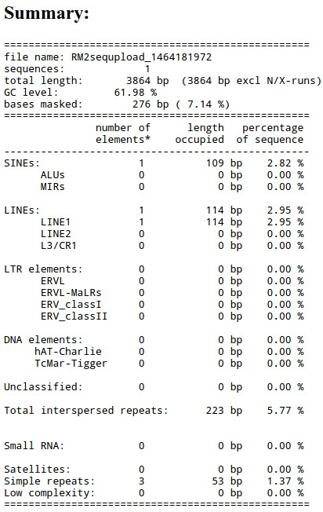
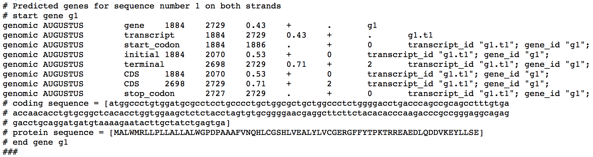

# Adnotacje genomowe i analiza funkcjonalna

Celem ćwiczeń jest zidentyfikowanie elementów powtarzalnych i genów we fragmencie genomowej sekwencji człowieka.

W trakcie ćwiczenia przeprowadzisz uproszczony schemat adnotacji fragmentu genomu:

1. identyfikacja i maskowanie sekwencji powtarzalnych,
2. przewidywanie struktury genu metodą *ab initio*,
3. sprawdzenie, czy przewidziany gen ma wsparcie w danych transkryptowych,
4. identyfikacja homologicznych białek,
5. identyfikacja domen białkowych.

## Identyfikacja elementów powtarzalnych

### Zad. 1

* Wejdź na stronę serwisu RepeatMasker: <http://www.repeatmasker.org>
* Z menu po lewej stronie wybierz serwis `RepeatMasking`.
* W polu `Sequence` umieść wejściową sekwencję genomową ([genomic.fasta](../files/genomic.fasta)).
* W polu `DNA source` wybierz genom człowieka.
* Zatwierdź przyciskiem `Submit sequence`.

> Wskazówka: W interpretacji wyników może przydać się pomoc RepeatMasker'a:  
> <http://www.repeatmasker.org/webrepeatmaskerhelp.html>



1. Ile wynosi procentowy udział wszystkich zidentyfikowanych sekwencji powtarzalnych, które zostały zamaskowane?
2. Wypisz nazwy elementów powtarzalnych, które zostały zidentyfikowane w sekwencji.
3. Do jakiego typu elementów powtarzalnych należą sekwencje SINE i LINE?
    - retrotranspozonów zawierających sekwencje LTR
    - retrotranspozonów niezawierających sekwencji LTR
    - prostych powtórzeń
    - regionów o niskiej złożoności nukleotydowej

Otwórz szczegółowe wyniki adnotacji w wersji tekstowej (`Annotation file`).

4. Wypisz sekwencje znalezionych prostych powtórzeń (`Simple repeats`).
5. Podaj miejsce początku i końca elementu LINE w sekwencji zapytania.

Wróć do strony z wynikami programu RepeatMasker. Otwórz szczegółowy raport przyrównania sekwencji zapytania ze znalezionymi sekwencjami elementów powtarzalnych (`Alignment file`).

6. Co oznaczają litery `i`, `v` w dopasowaniach?  
   *Wskazówka:* skorzystaj z pomocy RepeatMasker'a: <http://www.repeatmasker.org/webrepeatmaskerhelp.html>.

Wróć do strony z wynikami programu RepeatMasker. Otwórz wynikową sekwencję genomową, czyli plik `.masked`.

7. W jaki sposób sekwencje elementów powtarzalnych zostały zaznaczone, czyli zamaskowane, w sekwencji?

8. Uruchom ponownie program RepeatMasker. Tym razem w opcjach maskowania (`Masking options`) wybierz `Repetetive sequences in lower case`. Czy uzyskany wynik zawiera taki sam zakres informacji o analizowanej sekwencji jak poprzednio? Uzasadnij odpowiedź.

9. Zapisz zamaskowaną sekwencję genomową do pliku:

```bash
genomic_masked.fasta
```

10. Dlaczego przed przewidywaniem genów maskujemy sekwencje powtarzalne?

## Przewidywanie genów *ab initio*

### Zad. 2

W tej części ćwiczenia wykorzystamy program AUGUSTUS do przewidywania struktury genu w zamaskowanej sekwencji genomowej.

AUGUSTUS jest programem do przewidywania genów eukariotycznych na podstawie sekwencji genomowej. Na podstawie modeli statystycznych próbuje wskazać elementy struktury genu, takie jak egzony, introny, regiony kodujące, kodon start, kodon stop oraz potencjalną sekwencję białka.

Otwórz program AUGUSTUS:

<http://bioinf.uni-greifswald.de/augustus/submission.php>

W polu sekwencji wklej zamaskowaną sekwencję genomową:

```bash
genomic_masked.fasta
```

Wybierz model dla odpowiedniego gatunku.

Zatwierdź przyciskiem `Run AUGUSTUS`.

> Wskazówka: Informacje o opcjach i sposobie działania programu znajdziesz tutaj:  
> <http://bioinf.uni-greifswald.de/augustus/help>



Na podstawie wyniku AUGUSTUS odpowiedz na pytania:

1. Ile potencjalnych genów zostało zidentyfikowanych w analizowanej sekwencji?
2. Na której nici DNA został zidentyfikowany przewidziany gen?
3. Wypisz wszystkie zidentyfikowane elementy struktury genu wraz z ich lokalizacją w sekwencji genomowej.
4. Z ilu egzonów i intronów składa się przewidziany gen?
5. Z ilu aminokwasów składa się białko kodowane przez przewidziany gen?
6. Umieść sekwencję białka kodowanego przez przewidziany gen w formacie FASTA.
7. Czy w adnotacjach genów elementy `CDS` i `exon` oznaczają to samo?
8. Czy sama predykcja *ab initio* wystarcza, aby uznać, że przewidziany gen naprawdę istnieje? Uzasadnij odpowiedź.

## Analiza sekwencji EST

### Zad. 3

#### 3.1. Wyszukiwanie sekwencji EST

Korzystając z NCBI Nucleotide BLAST, przeszukaj bazę `Expressed sequence tags (est)` u człowieka, wykorzystując zamaskowaną sekwencję genomową jako zapytanie.

W wynikach programu BLAST, w zakładce `Descriptions`, zaznacz tylko najbardziej podobne dopasowania sekwencji EST, np. takie, które mają bardzo niską wartość E-value i identyczność >= 99%.

> Wskazówka: Możesz szybko zaznaczyć wiele sekwencji EST poprzez zaznaczenie kratki przy pierwszym dopasowaniu, a następnie zaznaczenie z wciśniętym klawiszem SHIFT ostatniej kratki, którą chcesz zaznaczyć.

1. Ile takich sekwencji zostało znalezionych?
2. O czym świadczy istnienie sekwencji EST pasujących do danego rejonu sekwencji genomowej?

Zapisz zaznaczone sekwencje:

```text
Download > Fasta (complete sequences)
```

Nazwij plik:

```bash
est.fasta
```

#### 3.2. Składanie sekwencji EST

W celu złożenia krótkich, nakładających się sekwencji EST w dłuższe sekwencje (contigi) użyj programu CAP3:

<http://doua.prabi.fr/software/cap3>

W polu sekwencji umieść pobrane sekwencje EST i naciśnij przycisk `Submit`.

Otwórz wyniki `Contigs`.

1. Ile złożonych sekwencji uzyskano?
2. O czym może świadczyć uzyskanie więcej niż jednego contigu?

Otwórz szczegóły złożenia (`Assembly details`).

3. Który contig został złożony z większej liczby sekwencji EST?
   
Otwórz wyniki `Single sequences`.

4. Czy jakieś sekwencje nie zostały uwzględnione w złożeniu?
5. Jakie mogą być przyczyny tego, że część sekwencji EST nie została włączona do żadnego contigu?

#### 3.3. Mapowanie contigów do genomu

W celu zmapowania contigów do sekwencji genomowej `genomic_masked.fasta` użyj programu FuzzyFinder:

<https://users.soe.ucsc.edu/~kent/fuzzyFind/fuzzyFind.html>

Wykorzystaj opcje:

- `strand` — `both`
- `match` — `cDNA`

Wykonaj osobno przyrównanie każdego contigu do sekwencji genomowej i zapisz jego lokalizację w sekwencji DNA.

1. Czy lokalizacje contigów pokrywają się z przewidywanymi sekwencjami kodującymi (`CDS`) programu AUGUSTUS?
2. Czy dane EST sugerują, że predykcja AUGUSTUS może być niepełna lub wymagać korekty?

## Wyszukiwanie sekwencji homologicznych

### Zad. 4

Korzystając z serwisu NCBI Protein BLAST, sprawdź, czy w bazie **RefSeq** (`Reference proteins (refseq_protein)`) znajdują się sekwencje **człowieka** podobne do sekwencji aminokwasowej przewidzianej przez program AUGUSTUS. Jako zapytania użyj przewidzianej sekwencji białkowej.

1. Jak nazywa się białko najbardziej podobne do przewidzianej sekwencji?
2. Czy wynik BLASTP wspiera predykcję wykonaną przez AUGUSTUS?

## Domeny białkowe

### Zad. 5

W celu identyfikacji domen białkowych występujących w sekwencji białkowej przewidzianej przez program AUGUSTUS użyj narzędzia InterPro:

<https://www.ebi.ac.uk/interpro/>

Wybierz:

```text
Search > By Sequence
```

Wklej sekwencję białkową przewidzianą przez AUGUSTUS.

1. Jaka domena białkowa została zidentyfikowana w tym białku? Do jakiej rodziny należy?

Otwórz rekord znalezionej rodziny białkowej.

2. Ile sekwencji zidentyfikowanych w bazie InterPro należy do tej rodziny?
3. W ilu organizmach ją zidentyfikowano (`Taxonomy`)?
4. Czy domena ta występuje u organizmów innych niż kręgowce?
